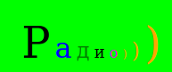
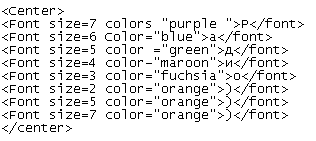

<html>
<Head>
<title>Буквы </title>

</head>
  <BODY>
Абзац  

 
Пример как из букв можно сделать рисунок 
(Шрифт размером 22 pt голубой цвет, полужирный)  
  
  

    

Р
а
д
и
о
)
)
)

  
  

</BODY>
</html>
