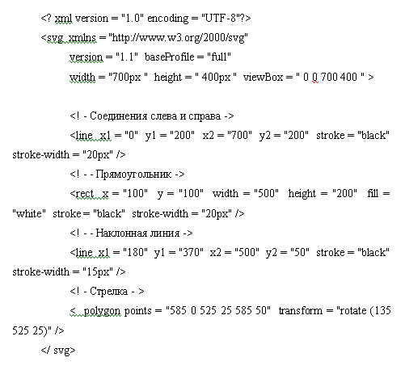

<html>
<head>

<title> Îáùèé âèä äîêóìåíòà html  </title>

</head>

<body>
<h1>Ôîðìàò SVG</h1>

Âîò ïðèìåð èçîáðàæåíèÿ, 
<object data="dd.svg" type="image/svg+xml"></object>

 
  

 

 Ñòðóêòóðà dd.svg (Øðèôò ðàçìåðîì 22 pt êðàñûé öâåò, ïîëóæèðíûé)  
  

</body>
</html>
